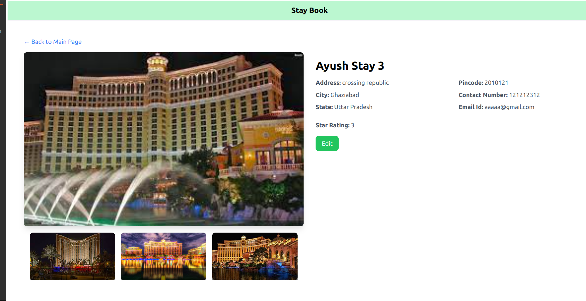
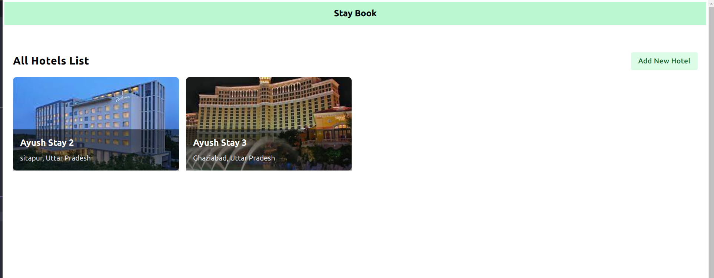

# Stay Book

## Introduction

This project is a Hotel Management System built with Next.js, Typescript and Firebase. It allows users to manage hotel details, including adding new hotels, editing existing ones, and deleting hotels.

## Installation

To get started with the project, follow these steps:

1. Clone the repository:

   ```bash
   git clone https://github.com/your-username/hotel-management-system.git
   
2. Navigate to the project directory:
    
       
        cd Drag-n-Drop
3. Install dependencies:
    ```bash
    npm install
    
4. Start the development server:

        npm run dev

5.  Open http://localhost:5173 in your browser to view the application.

## Features
### Add New Hotel
1. Users can add a new hotel by providing details such as name, address, contact number, star rating, images, etc.
2. Image upload supports multiple images and displays a preview of selected images.

### Edit Existing Hotel
1. Users can edit existing hotel details, including name, address, contact information, and images.

### Delete Hotel
1. Hotel deletion feature allows users to remove hotels from the system.
Deleting a hotel removes its details from the database and any associated images.

### Viewing Hotel Details
1. The application displays detailed information about each hotel, including name, address, contact information, star rating, and images.

## Usage




